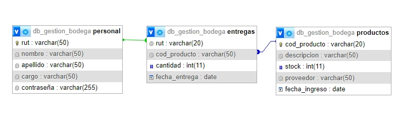

# Mision Curso Introductivo PHP Jovenes Programadores

## Descripción
Sistema Minimalista de Gestion de Bodega correspondiente a la solucion de curso de PHP de jovenes programadores
[Curso PHP 1](https://jp.biblioredes.gob.cl/moodle/course/view.php?id=74)

## Instalar XAMP
Se requiere de XAMP para facilitar la instalacion de la Solucion.
[Descargar XAMP](https://www.apachefriends.org/download.html)

## Instalación
Se recomienda Importar la Base de Datos empleando el SQL llamado *db_gestion_bodega.sql*.

## Clonar el repositorio
git clone https://github.com/usuario/repositorio.git

### Datos de Ejemplo

El administrador principal es:
```bash
20.248.430-1 20248
```

Un bodegero es:
```bash
19.976.780-1 19976
```

## Esquema de la Base de Datos




```sql
CREATE TABLE `entregas` (
  `rut` varchar(20) NOT NULL,
  `cod_producto` varchar(50) NOT NULL,
  `cantidad` int(11) NOT NULL,
  `fecha_entrega` date NOT NULL
) ENGINE=InnoDB DEFAULT CHARSET=utf8mb4 COLLATE=utf8mb4_general_ci;

CREATE TABLE `personal` (
  `rut` varchar(50) NOT NULL,
  `nombre` varchar(50) NOT NULL,
  `apellido` varchar(50) NOT NULL,
  `cargo` varchar(50) NOT NULL,
  `contraseña` varchar(255) NOT NULL
) ENGINE=InnoDB DEFAULT CHARSET=utf8mb4 COLLATE=utf8mb4_general_ci;

CREATE TABLE `productos` (
  `cod_producto` varchar(20) NOT NULL,
  `descripcion` varchar(50) NOT NULL,
  `stock` int(11) NOT NULL,
  `proveedor` varchar(50) NOT NULL,
  `fecha_ingreso` date NOT NULL
) ENGINE=InnoDB DEFAULT CHARSET=utf8mb4 COLLATE=utf8mb4_general_ci;
```

## Estructura de Carpetas y Archivos
```bash
mision
├── README.md
├── index.php
└── src
    ├── config
    │   ├── conexion.php
    │   ├── db
    │   │   └── db_gestion_bodega.sql     
    │   └── schema.jpeg
    ├── controllers
    │   ├── agregar_producto_process.php  
    │   ├── crear_personal_process.php    
    │   ├── eliminar_personal_process.php 
    │   ├── eliminar_producto_process.php 
    │   ├── entregas_process.php
    │   ├── modificar_personal_process.php
    │   ├── modificar_producto_process.php
    │   ├── realizar_entrega_process.php  
    │   └── validar.php
    ├── helpers
    │   ├── salir.php
    │   └── sesion.php
    ├── img
    │   ├── ad.png
    │   ├── adp.png
    │   ├── cerrar.png
    │   ├── el.png
    │   ├── elp.png
    │   ├── entrega.png
    │   ├── entregado.png
    │   ├── home.png
    │   ├── mod.png
    │   └── modp.png
    └── views
        ├── agregar_productos.php
        ├── crear_personal.php
        ├── eliminar_personal.php
        ├── eliminar_producto.php
        ├── entregas.php
        ├── login.php
        ├── modificar_personal.php
        ├── modificar_producto.php
        ├── principalAdmin.php
        ├── principalBodega.php
        └── realizar_entrega.php
```